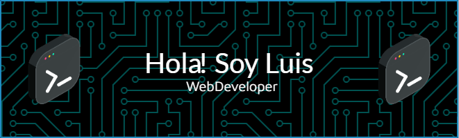

#  Bienvenid@s a mi Github

  <b>🧑‍💻Sobre mí🧑‍💻</b> Mi entusiasmo por la tecnología y la programación me ha llevado a trabajar en diversos proyectos que han fortalecido mis conocimientos y habilidades en lenguajes como JavaScript, Python y Java, entre otros. Mi enfoque es crear soluciones eficientes y bien estructuradas, y siempre busco oportunidades para aprender algo nuevo cada día.  🌟<b>Desarrollo de software:</b> Con experiencia en desarrollo backend y frontend, puedo contribuir en todas las etapas del ciclo de vida del desarrollo de software. <b>🌟Trabajo en equipo:</b> Disfruto trabajar en equipo y colaborar con otros desarrolladores, diseñadores y partes interesadas para lograr objetivos comunes. <b>🌟Innovación constante:</b> Estoy comprometido con el aprendizaje continuo y la adopción de nuevas tecnologías y mejores prácticas en el desarrollo de software.   <b>🔥Mis intereses</b> Me encanta participar en proyectos desafiantes que me permitan aplicar mis conocimientos y aprender nuevas tecnologías. Estoy particularmente interesado en el desarrollo de aplicaciones web. Mi objetivo es crecer profesionalmente y contribuir significativamente a los proyectos en los que participo.  <b>📲Contacto</b> Estoy siempre abierto a nuevas oportunidades y colaboraciones. Si estás buscando un desarrollador entusiasta y comprometido con el aprendizaje continuo y la excelencia en la programación, ¡no dudes en contactarme!  <b>🫂¡Gracias por visitar mi perfil!🫂</b>

## 🌐 Socials:
 

# 💻 Tech Stack:
                                          
# 📊 GitHub Stats:
 
 

## 🏆 GitHub Trophies

---

<!-- Proudly created with GPRM ( https://gprm.itsvg.in ) -->
